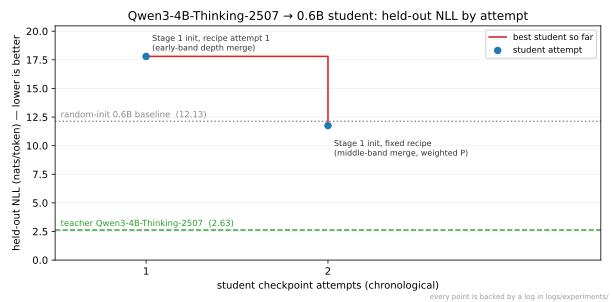

# AlphaAvatar-distill

## 📈 Performance Trend and Project Goal

AlphaAvatar-distill aims to build an agent-guided model compression and distillation framework for transforming large teacher models into small, real-time, edge-deployable student models.

The project goal is to make distillation reproducible, automated, and useful for realtime AI assistant runtimes, including RAG, tool use, reasoning, self-correction, quantized inference, and low-latency deployment.

[](./assets/performance_trend.svg)

Every point is backed by a log in [`logs/experiments/`](./logs/experiments/); the figure regenerates from [`assets/perf_trend.json`](./assets/perf_trend.json) via `uv run python scripts/plot_perf_trend.py`. New student attempts are appended as stages progress (recovery training has not started yet — the gap to the teacher line is the work ahead).

**Current experiment:** compressing [Qwen/Qwen3-4B-Thinking-2507](https://huggingface.co/Qwen/Qwen3-4B-Thinking-2507) into a 0.6B-class student (Qwen3-0.6B geometry, ~6.7× compression, INT8 deployment target). Stage 0 (teacher activation statistics, ~950K tokens), Stage 1 (teacher-projected structural initialization, 596M params), and Stage 2 (grouped offline training mixture, 5.39M train tokens across 8 behavior groups) have passed their validation gates. The Stage 3 recovery trainer (masked CE + on-the-fly teacher KD, exact resume) is implemented and smoke-verified on CPU; the first real recovery run has not happened yet. Details: [Stage 0 log](./logs/experiments/2026-07-13_stage0_qwen3_4b_thinking_v1.md), [Stage 1 log](./logs/experiments/2026-07-14_stage1_qwen3_0p6b_init_v0.md), [Stage 2 log](./logs/experiments/2026-07-21_stage2_offline_v0.md), [Stage 3 trainer log](./logs/experiments/2026-07-22_stage3_trainer_toy.md).

_A performance trend chart will be added once official optimization records exist, with every point linked to its experiment record._

---

## 🧠 How it works

Implemented so far (later stages are described in [`AGENTS.md`](./AGENTS.md) but not yet built):

1. **Stage 0 — activation statistics.** The teacher runs over a small, license-clean warm-up corpus while the collector accumulates streaming sufficient statistics in float64: per residual point token count, sum, and uncentered second moment `X^T X`; per-FFN-neuron `sum |a|` and `sum a²`; token frequencies. The cache is fixed-size (1.95 GB for a 4B teacher) regardless of token count.
2. **Stage 1 — projection + sandwich initialization.** A single global orthonormal projection `P` (eigenvectors of the trace-normalized average of the residual second moments, with the embedding-output and post-final-norm points upweighted) defines the student's hidden space. Every teacher linear is transplanted as `P^T·W·P` with the preceding RMSNorm weight folded in exactly; Q heads are subsampled per GQA group, FFN neurons kept by activation importance, and depth is compressed by merging middle-band layer pairs (first-of-span representative). The result is a complete, runnable Qwen3-format student checkpoint plus a same-geometry random baseline, both wrapped in reproducibility manifests.
3. **Stage 2 — offline warm-up mixture.** A deterministic, revision-pinned builder assembles eight training-use groups from permissive public sources (instruction, RAG/evidence, multi-hop QA, tool calling in the Qwen3 tool schema, refusal/uncertainty, code/math, short realtime, long context) with global dedup, eval-holdout exclusion, and per-group train/val/calib splits — the stratified calib slice doubles as the INT8 calibration set. The loader renders conversations with the teacher's chat template and computes assistant-span loss masks by character offsets (the Thinking-2507 template is not prefix-stable), packing everything into fixed-length blocks for the recovery trainer.
4. **Stage 3 — recovery trainer (implemented; first real run pending).** One config-driven trainer covers the recovery sub-stages: a regex freeze policy selects what trains (sub-stage 1 recovers FFN + norms with attention frozen; later sub-stages unfreeze more), and the loss mixes masked next-token CE with on-the-fly forward-KL distillation of the teacher's full-vocab distribution (the teacher runs on the same packed blocks — no cached logits). Block order is a pure function of (seed, epoch), so an interrupted run resumes bitwise-exactly from its checkpoint (verified in tests and in a real-model smoke). Training events stream to an append-only jsonl log; every run writes a manifest with config, data, tokenizer, teacher, and code-state hashes.

Every run records config hash, code state, dataset/tokenizer/teacher hashes, and gate-check results; heavy artifacts stay out of git.

---

## ⚡ Quick start

```bash
uv sync   # CPU-only torch by default; see pyproject.toml to switch to a CUDA index
uv run pytest tests/ -q
```

The implemented pipeline runs end to end on CPU (GPU optional):

```bash
# rebuild the warm-up corpus (revision-pinned public sources, gitignored jsonl)
uv run python scripts/build_warmup_v1.py

# Stage 0: teacher activation statistics (~1 h CPU for ~950K tokens; dry run: --limit 2)
uv run python scripts/collect_stage0.py --config configs/stage0_qwen3_4b_thinking_v1.json

# Stage 1: initialize the 0.6B student from the teacher + stats (~5 min)
uv run python scripts/init_stage1.py --config configs/stage1_qwen3_0p6b_from_4b_thinking.json

# held-out perplexity comparison (teacher vs init vs random baseline)
uv run python scripts/build_holdout_v1.py
uv run python scripts/eval_ppl.py --data data/warmup/holdout_v1.jsonl \
  --model artifacts/stage1/qwen3_0p6b_init_v0/checkpoint \
  --model artifacts/stage1/qwen3_0p6b_init_v0/random_baseline

# Stage 2: build the grouped offline mixture (revision-pinned public sources)
uv run python scripts/build_stage2_v0.py
uv run python scripts/dry_run_stage2.py   # loader gate check (~12 s)

# Stage 3: recovery trainer smoke (3 real KD steps on CPU, ~3 min); the full
# run uses configs/stage3_s1_ffn_norm.json on a GPU
uv run python scripts/train_stage3.py --config configs/stage3_smoke_cpu.json
uv run python scripts/train_stage3.py --config configs/stage3_smoke_cpu.json --resume
```

Each step writes gitignored artifacts plus a full reproducibility manifest under `artifacts/` or `data/`. The first real Stage 3 recovery run, and Stages 4+ (on-policy distillation, deployment), have not happened yet. See [`logs/STATE.md`](./logs/STATE.md) for current state and next actions.

---

## 🤖 Running the agent

This project is developed by autonomous coding agents (e.g. Claude Code, Codex, Cursor). [`AGENTS.md`](./AGENTS.md) is the single source of truth for agent instructions and must be read before making any change to this repository.

The first dense-model compression experiment was kicked off with this instruction to the agent:

> Hi, have a look at the AlphaAvatar-distill repo and start from the teacher model https://huggingface.co/Qwen/Qwen3-4B-Thinking-2507. Let's kick off the first dense-model compression experiment.

Everything under `src/`, `scripts/`, and `logs/` grew from that instruction, following the staged workflow in `AGENTS.md`. Current session state and the next recommended actions live in [`logs/STATE.md`](./logs/STATE.md).

---

## 🗂️ Project structure

```text
AlphaAvatar-distill/
├── AGENTS.md                   # agent working contract (single source of truth)
├── CLAUDE.md                   # Claude Code entrypoint (points to AGENTS.md)
├── LICENSE
├── README.md
├── pyproject.toml              # uv-managed env; CPU torch index by default
├── uv.lock
├── assets/
│   ├── perf_trend.json                     # trend-figure data (each point links to a log)
│   └── performance_trend.svg               # rendered by scripts/plot_perf_trend.py
├── configs/
│   ├── stage0_qwen3_4b_thinking.json       # Stage 0 v0 config (47-sample warm-up)
│   ├── stage0_qwen3_4b_thinking_v1.json    # Stage 0 v1 config (~950K-token warm-up)
│   ├── stage1_qwen3_0p6b_from_4b_thinking.json  # Stage 1 init recipe (0.6B student)
│   ├── stage3_s1_ffn_norm.json             # Stage 3 recovery sub-stage 1 (GPU-sized; not yet run)
│   └── stage3_smoke_cpu.json               # Stage 3 3-step CPU smoke config
├── data/
│   ├── warmup/
│   │   ├── warmup_v0.jsonl                 # 47 handcrafted warm-up samples (committed)
│   │   ├── warmup_v1.manifest.json         # v1 corpus manifest (jsonl gitignored, rebuildable)
│   │   └── holdout_v1.manifest.json        # held-out eval set manifest (jsonl gitignored)
│   └── stage2/
│       └── stage2_offline_v0.manifest.json # offline mixture manifest (train/val/calib jsonl gitignored)
├── logs/
│   ├── STATE.md                # current project state and next actions
│   ├── decisions.md            # decision records
│   ├── supported_models.md     # model status table
│   └── experiments/            # per-run experiment logs
├── scripts/
│   ├── collect_stage0.py       # Stage 0 CLI: teacher activation-stats collection
│   ├── plot_perf_trend.py      # renders the README performance-trend figure
│   ├── build_warmup_v1.py      # warm-up corpus builder (revision-pinned sources)
│   ├── build_holdout_v1.py     # held-out eval set builder
│   ├── init_stage1.py          # Stage 1 CLI: student init + gate checks + manifest
│   ├── eval_ppl.py             # deterministic NLL/perplexity evaluation
│   ├── build_stage2_v0.py      # Stage 2 offline mixture builder (8 groups, pinned sources)
│   ├── dry_run_stage2.py       # Stage 2 gate: loader/masking/packing dry run
│   └── train_stage3.py         # Stage 3 CLI: recovery training with --resume + run manifests
├── tests/
│   ├── test_collect_toy.py     # CPU toy tests for the Stage 0 collector
│   ├── test_stage1_toy.py      # Stage 1 algebra tests (identity-projection exactness)
│   ├── test_data_toy.py        # Stage 2 loader tests (schema, loss masks, packing)
│   └── test_train_toy.py       # Stage 3 trainer tests (loss math, freeze, exact resume)
└── src/aadistill/              # algorithm core
    ├── collect.py              # streaming activation-statistics collector
    ├── data.py                 # Stage 2+ loader: schema, chat render, loss masks, packing
    ├── env.py                  # env fingerprint, code-state hash, determinism
    ├── manifest.py             # sha256 + JSON manifest helpers
    ├── project.py              # stream projection + FFN importance + final-norm solve
    ├── sandwich.py             # depth map, head selection, sandwich init_student
    ├── student.py              # Qwen3 student config/model builder
    ├── teacher.py              # teacher loading with pinned revision + identity record
    └── train.py                # Stage 3 recovery trainer (CE+KD, freeze policy, exact resume)
```

New directories are added only when required by an implemented and verified milestone, per `AGENTS.md`. Model weights, activation caches, and experiment artifacts are kept out of git (`.gitignore`).

---

## 🏆 Optim record history

Only add records backed by reproducible experiment logs. Do not add placeholder results.

### 🧪 Stage 0 — Initialization warm-up data collection

_No records yet._

### 🧩 Stage 1 — Projection and structural initialization

_No records yet._

### 📚 Stage 2 — Offline warm-up data collection

_No records yet._

### 🛠️ Stage 3 — Student recovery

_No records yet._

### 🔁 Stage 4 — Online data collection

_No records yet._

### 🎯 Stage 5 — On-policy distillation

_No records yet._

### 🚀 Stage 6 — Deployment validation

_No records yet._

---

## 🔎 References

| Reference | Topic | Status | Why it matters here |
| --- | --- | --- | --- |
| Muralidharan et al., *Compact Language Models via Pruning and Knowledge Distillation* (Minitron), NVIDIA, 2024. [arXiv:2407.14679](https://arxiv.org/abs/2407.14679) | ffn-pruning, distillation | used | Activation-magnitude neuron/head importance for structured width pruning; establishes that pruned-before-recovery students score near-noise zero-shot and rely on distillation recovery. Informed Stage 1 FFN top-k selection and the interpretation of the init-checkpoint eval (see 2026-07-14 Stage 1 experiment log). |
| Gromov et al., *The Unreasonable Ineffectiveness of the Deeper Layers*, 2024. [arXiv:2403.17887](https://arxiv.org/abs/2403.17887) | depth-compression | used | Layer-drop studies show early layers are critical and middle/late-middle layers are most redundant. Motivated moving Stage 1 depth merging from the early band to the middle band after the early-merge ablation collapsed (single-axis ablation, 2026-07-14). |
| Xia et al., *Sheared LLaMA: Accelerating Language Model Pre-training via Structured Pruning*, 2023. [arXiv:2310.06694](https://arxiv.org/abs/2310.06694) | svd-compression, distillation | queued | Structured pruning with mask learning + continued pre-training; candidate comparison recipe for Stage 3 recovery design. |

---

## 📚 Citation

If you use AlphaAvatar-distill in your research or projects, please cite it as:

```bibtex
@misc{alphaavatar_distill_2026,
  author       = {Licheng Wang and AlphaAvatar Contributors},
  title        = {AlphaAvatar-distill: Agentic Model Compression for Realtime and Edge AI Assistants},
  year         = {2026},
  url          = {https://github.com/AlphaAvatar/AlphaAvatar-distill}
}
```
