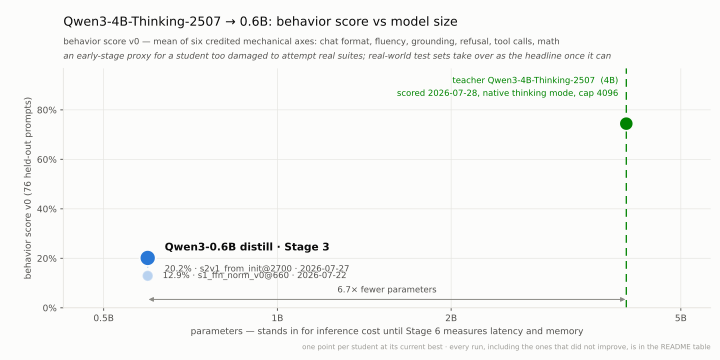

# AlphaAvatar-distill

## 📈 Performance Trend and Project Goal

AlphaAvatar-distill is an agent-guided model compression and distillation framework for turning large teacher models into small, real-time, edge-deployable students.

The goal is to make distillation **reproducible, automated, and useful for realtime assistant runtimes** — RAG, tool use, reasoning, self-correction, quantized inference, low-latency deployment.

[](./assets/performance_trend.svg)

**Current experiment:** [Qwen/Qwen3-4B-Thinking-2507](https://huggingface.co/Qwen/Qwen3-4B-Thinking-2507) → a 0.6B-class student (Qwen3-0.6B geometry, ~6.7× compression, INT8 deployment target). Numbers below are held-out NLL on `holdout_v1` (21,080 tokens of fineweb-edu); the numbers in the figure are the `#` column here.

The runs are a tree, not a queue, so the figure draws them that way: each point sits at the cumulative optimizer steps of its own lineage and is joined to the checkpoint it started from (the `starts from` column). Sibling arms leave a shared parent — reading them as one sequence would imply progress that was never measured.

| # | date | run | starts from | what changed | total steps | held-out NLL |
| ---: | --- | --- | :---: | --- | ---: | ---: |
| 1 | 2026-07-14 | [init v0, recipe attempt 1](./logs/experiments/2026-07-14_stage1_qwen3_0p6b_init_v0.md) | — | early-band depth merge, unweighted projection | 0 | 17.7977 |
| 2 | 2026-07-14 | [init v0, fixed recipe](./logs/experiments/2026-07-14_stage1_qwen3_0p6b_init_v0.md) | — | middle-band merge, end-weighted projection | 0 | 11.7482 |
| 3 | 2026-07-22 | [s1 recovery](./logs/experiments/2026-07-22_stage3_s1_gpu_run.md) | #2 | FFN+norm, CE 0.25 + KD 1.0, 660 steps on mixture v0 | 660 | 4.2107 |
| 4 | 2026-07-25 | [s2 A/B arm A](./logs/experiments/2026-07-25_stage3_s2_ab_gpu_run.md) | #3 | control: +660 FFN-only steps; regressed on mixture-v0 epochs 3–4 | 1320 | 4.2747 |
| 5 | 2026-07-25 | [s2 A/B arm B](./logs/experiments/2026-07-25_stage3_s2_ab_gpu_run.md) | #3 | attention unfrozen; freeze set adopted, holdout flat (data-limited) | 1320 | 4.2118 |
| 6 | 2026-07-26 | [s2 on mixture v1](./logs/experiments/2026-07-26_stage3_s2_blocks_v1_gpu_run.md) | #5 | same recipe, 4.11× data, 2700 steps; plateau broken | 4020 | **3.8003** |
| 7 | 2026-07-27 | [start-point ablation: from_s1](./logs/experiments/2026-07-27_stage3_start_point_ablation.md) | #3 | same 2700-step leg from s1@660; the A/B arm-B leg was neutral (+0.17%) | 3360 | 3.8067 |
| 8 | 2026-07-27 | [start-point ablation: from_init](./logs/experiments/2026-07-27_stage3_start_point_ablation.md) | #2 | single-stage from Stage 1 init, 2700 steps total; warm-up ladder unnecessary (+0.74%) | 2700 | 3.8285 |

Reference points on the same set: teacher **2.6264** · random-init 0.6B baseline **12.1286**.

Attempts 7–8 are a fixed-budget ablation of the *start point*, not of the training leg: runs 6–8 are the three branches that ran the identical 2700-step leg at the same seed, from lineages costing 4020, 3360 and 2700 total steps. Both landed inside the pre-registered 1% band, so the recovery recipe dropped its two warm-up legs and became a single stage — a third less compute per iteration.

That ablation also motivated a second, non-NLL gate. `holdout_v1` is fineweb-edu text and is nearly blind to chat format, grounding, refusal and tool-call validity, which is where these students actually fail; [`eval_behavior_v0`](./data/eval_behavior_v0/) scores 76 held-out prompts with mechanical checks only (no LLM judge, so it is free and reproducible from the stored generations). It **reversed the ranking above**: the cheapest lineage (attempt 8) is the best-behaved one, and the best-NLL checkpoint (attempt 6) is the worst. Details and caveats — single run per arm, no variance estimate — are in the [run log](./logs/experiments/2026-07-27_stage3_start_point_ablation.md). Current state and next actions: [`logs/STATE.md`](./logs/STATE.md); costed, unapproved work: [`logs/proposals/`](./logs/proposals/).

The figure regenerates from [`assets/perf_trend.json`](./assets/perf_trend.json) with `uv run python scripts/plot_perf_trend.py`; the table above comes from the same file via `--print-table`, and every point is backed by a log in [`logs/experiments/`](./logs/experiments/).

---

## 🧠 How it works

| Stage | What it produces | Status |
| --- | --- | --- |
| **0** — activation statistics | streaming float64 sufficient statistics from the teacher: per residual point count / sum / `XᵀX`, per-FFN-neuron `Σ\|a\|` and `Σa²`, token frequencies. Fixed 1.95 GB cache regardless of token count. | passed ([log](./logs/experiments/2026-07-13_stage0_qwen3_4b_thinking_v1.md)) |
| **1** — projection + sandwich init | a complete, runnable Qwen3-format 0.6B student (596M params) plus a same-geometry random baseline, both with reproducibility manifests. | passed ([log](./logs/experiments/2026-07-14_stage1_qwen3_0p6b_init_v0.md)) |
| **2** — offline warm-up mixture | eight training-use groups from permissive revision-pinned sources (instruction, RAG/evidence, multi-hop QA, tool calling, refusal/uncertainty, code/math, short realtime, long context) with global dedup, holdout exclusion, and train/val/calib splits. | v0 5.39M tokens ([log](./logs/experiments/2026-07-21_stage2_offline_v0.md)), v1 22.13M ([log](./logs/experiments/2026-07-26_stage2_offline_v1.md)) |
| **3** — student recovery | one config-driven trainer for all recovery sub-stages: regex freeze policy, masked CE + on-the-fly full-vocab teacher KD, exact resume, per-run manifests, gate evals. | sub-stages 1–2 passed; further runs [proposed](./logs/proposals/) |
| **4–6** — online data, on-policy distillation, deployment validation | specified in [`AGENTS.md`](./AGENTS.md) | not started |

Design choices worth knowing:

- **Sufficient statistics, not activation dumps.** Stage 0 caches exactly what Stage 1 consumes (second moments, neuron importances, token frequencies) in float64, so the cache is O(1) in token count and the centering step stays numerically sound.
- **One global projection, transplanted sandwich-style.** Every teacher linear becomes `Pᵀ·W·P` with the preceding RMSNorm folded in exactly; Q heads are subsampled per GQA group, FFN neurons kept by activation importance, depth compressed by merging middle-band layer pairs. Attempt 1 in the table above is what happened when the merge band was wrong — the recipe is evidence-driven, not assumed.
- **Loss masks are computed from character offsets.** The Thinking-2507 chat template is *not* prefix-stable (it injects an empty think block into the final assistant turn), so the usual per-turn prefix diffing miscounts spans. The loader renders the conversation once and maps assistant character spans to tokens.
- **KD runs on the fly over the full vocabulary.** The teacher forwards the same packed blocks each step — no cached logits, so the corpus is not welded to one teacher revision and top-k approximation is unnecessary.
- **Block order is a pure function of (seed, epoch).** An interrupted run resumes bitwise-exactly. The validation subset is seed-derived too, which is why runs meant to be compared must share a seed ([decision record](./logs/decisions.md)).
- **Deployment numerics are a gate, not an afterthought.** Every recovery gate re-evaluates under INT8 weight fake-quantization at two scopes, so quality that quantization would destroy never counts as progress.
- **Ablations are config diffs.** The two proposed start-point arms differ from the completed mixture-v1 run in exactly one meaningful field, verified by diff.

Every run records config hash, code state, dataset/tokenizer/teacher hashes, and gate-check results; heavy artifacts stay out of git. GPU sessions run under a durable OS-level orchestrator that trains, evaluates, uploads artifacts, verifies the upload against pod-side hashes, generates the write-up, and tears the pod down unattended.

---

## ⚡ Quick start

```bash
uv sync                    # CPU torch by default; see pyproject.toml for a CUDA index
uv run pytest tests/ -q    # 95 CPU tests, no downloads
```

The implemented pipeline runs end to end on CPU (GPU optional):

```bash
# corpora (revision-pinned public sources; the jsonl files stay gitignored)
uv run python scripts/build_warmup_v1.py       # Stage 0/1 warm-up (~1M tokens)
uv run python scripts/build_holdout_v1.py      # held-out eval set
uv run python scripts/build_stage2_v0.py       # offline mixture v0 (5.39M train tokens)
uv run python scripts/build_stage2_v1.py       # offline mixture v1 (22.13M train tokens)

# Stage 0 → 1: teacher statistics (~1 h CPU; dry run with --limit 2), then init (~5 min)
uv run python scripts/collect_stage0.py --config configs/stage0_qwen3_4b_thinking_v1.json
uv run python scripts/init_stage1.py --config configs/stage1_qwen3_0p6b_from_4b_thinking.json

# gate checks
uv run python scripts/dry_run_stage2.py --data-dir data/stage2_v1 \
  --out artifacts/stage2/dry_run_v1_report.json
uv run python scripts/eval_ppl.py --data data/warmup/holdout_v1.jsonl \
  --model artifacts/stage1/qwen3_0p6b_init_v0/checkpoint \
  --model artifacts/stage1/qwen3_0p6b_init_v0/random_baseline

# Stage 3 recovery: 3 real KD steps on CPU, then the same code path with --resume
uv run python scripts/train_stage3.py --config configs/stage3_s2v1_smoke_cpu.json
uv run python scripts/train_stage3.py --config configs/stage3_s2v1_smoke_cpu.json --resume

# any checkpoint, at the deployment precision (bf16 baseline + INT8 weight fake-quant)
uv run python scripts/eval_ppl.py --data data/warmup/holdout_v1.jsonl \
  --model artifacts/stage3/s1_ffn_norm_v0/checkpoints/step_000660/model \
  --fake-quant int8 --fake-quant-scope decoder
```

Real recovery runs use the same CLI with a GPU-sized config (e.g. `configs/stage3_s2_blocks_v1.json`) — hardware never changes the experiment definition. Each step writes gitignored artifacts plus a full reproducibility manifest under `artifacts/` or `data/`.

---

## 🤖 Running the agent

This project is developed by autonomous coding agents (e.g. Claude Code, Codex, Cursor). [`AGENTS.md`](./AGENTS.md) is the single source of truth for agent instructions and must be read before making any change to this repository.

The first dense-model compression experiment was kicked off with this instruction:

> Hi, have a look at the AlphaAvatar-distill repo and start from the teacher model https://huggingface.co/Qwen/Qwen3-4B-Thinking-2507. Let's kick off the first dense-model compression experiment.

Everything under `src/`, `scripts/`, and `logs/` grew from that instruction, following the staged workflow in `AGENTS.md`. The working split is: agents act directly on local, reversible, CPU-scale work, and write a **costed proposal with pre-registered decision rules** for anything paid, long-running, or public-facing — the maintainer approves per session. Pending proposals live in [`logs/proposals/`](./logs/proposals/); current state and next actions in [`logs/STATE.md`](./logs/STATE.md).

---

## 🗂️ Project structure

```text
AlphaAvatar-distill/
├── AGENTS.md               # agent working contract (single source of truth)
├── CLAUDE.md               # Claude Code entrypoint (points to AGENTS.md)
├── pyproject.toml          # uv-managed env; CPU torch index by default
├── src/aadistill/          # algorithm core — model-agnostic, config-driven
│   ├── collect.py          #   Stage 0 streaming activation statistics
│   ├── project.py          #   stream projection, FFN importance, final-norm solve
│   ├── sandwich.py         #   depth map, head selection, sandwich transplant
│   ├── student.py          #   Qwen3 student config/model builder
│   ├── teacher.py          #   pinned-revision teacher loading + identity record
│   ├── data.py             #   mixture loader: schema, chat render, loss masks, packing
│   ├── train.py            #   Stage 3 recovery trainer (CE+KD, freeze policy, resume)
│   ├── quant.py            #   INT8 weight fake-quantization for deployment evals
│   ├── behavior.py         #   eval_behavior_v0 scorers: format, echo, grounding, tools
│   ├── env.py              #   env fingerprint, code-state hash, determinism
│   └── manifest.py         #   sha256 + JSON manifest helpers
├── scripts/                # one CLI per stage + corpus builders + eval + figure
│   ├── eval_ppl.py         #   held-out NLL / perplexity, optional INT8 fake-quant
│   ├── eval_behavior.py    #   behavior scorecard for a checkpoint (greedy, mechanical)
│   └── pod/                #   GPU session scripts and durable orchestrator (run_env.sh)
├── configs/                # stage recipes; Stage 3 runs are one config each
├── data/                   # corpus manifests (jsonl gitignored, rebuildable)
│   └── eval_behavior_v0/   #   76-prompt behavior set + manifest (both committed)
├── tests/                  # 95 CPU tests: algebra, loader, trainer, quant, scorers, builders
├── logs/                   # project memory — read STATE.md first
│   ├── STATE.md            #   current state, verified facts, next actions
│   ├── decisions.md        #   decision records (why, alternatives, risks)
│   ├── experiments/        #   per-run logs with commands, hashes, gate checks
│   ├── proposals/          #   costed proposals awaiting maintainer approval
│   ├── supported_models.md #   model status table
│   └── artifact_manifests.md  # artifacts stored outside git (HF), with hashes
└── assets/                 # trend data + rendered figure
```

The tree above is abridged to the parts worth knowing about. New directories appear only when an implemented, verified milestone needs them. Model weights, activation caches, and experiment artifacts are kept out of git (`.gitignore`); large checkpoints live in a private Hugging Face repo with hashes recorded in `logs/artifact_manifests.md`.

---

## 🏆 Optim record history

Official records are stricter than ordinary experiments (AGENTS.md 3.8): exact commit, command, hardware, data and tokenizer hashes, budget, metric log, and maintainer approval. Reproducible Stage 3 records exist in `logs/experiments/`, but none has been approved as an official record yet, so every section below is intentionally empty.

### 🧪 Stage 0 — Initialization warm-up data collection

_No records yet._

### 🧩 Stage 1 — Projection and structural initialization

_No records yet._

### 📚 Stage 2 — Offline warm-up data collection

_No records yet._

### 🛠️ Stage 3 — Student recovery

_No records yet._

### 🔁 Stage 4 — Online data collection

_No records yet._

### 🎯 Stage 5 — On-policy distillation

_No records yet._

### 🚀 Stage 6 — Deployment validation

_No records yet._

---

## 🔎 References

| Reference | Topic | Status | Why it matters here |
| --- | --- | --- | --- |
| Muralidharan et al., *Compact Language Models via Pruning and Knowledge Distillation* (Minitron), NVIDIA, 2024. [arXiv:2407.14679](https://arxiv.org/abs/2407.14679) | ffn-pruning, distillation | used | Activation-magnitude neuron/head importance for structured width pruning; establishes that pruned-before-recovery students score near-noise zero-shot and rely on distillation recovery. Informed Stage 1 FFN top-k selection and the interpretation of the init-checkpoint eval ([log](./logs/experiments/2026-07-14_stage1_qwen3_0p6b_init_v0.md)). |
| Gromov et al., *The Unreasonable Ineffectiveness of the Deeper Layers*, 2024. [arXiv:2403.17887](https://arxiv.org/abs/2403.17887) | depth-compression | used | Layer-drop studies show early layers are critical and middle/late-middle layers are most redundant. Motivated moving Stage 1 depth merging from the early band to the middle band after the early-merge ablation collapsed. |
| Xia et al., *Sheared LLaMA: Accelerating Language Model Pre-training via Structured Pruning*, 2023. [arXiv:2310.06694](https://arxiv.org/abs/2310.06694) | svd-compression, distillation | queued | Structured pruning with mask learning + continued pre-training; candidate comparison recipe for Stage 3 recovery design. |
| Kim & Rush, *Sequence-Level Knowledge Distillation*, EMNLP 2016. [arXiv:1606.07947](https://arxiv.org/abs/1606.07947) | distillation, offline-data | queued | Training the student on the teacher's *generated* targets rather than on gold targets reweighted by the teacher. Basis of the pending teacher-generated-answer proposal, which targets the answer-style defects that survived the mixture-v1 recovery run ([proposal](./logs/proposals/2026-07-27_stage2_teacher_generated_answers.md)). |
| Zelikman et al., *STaR: Bootstrapping Reasoning With Reasoning*, NeurIPS 2022. [arXiv:2203.14465](https://arxiv.org/abs/2203.14465) | offline-data, distillation | queued | Keep only generations whose final answer matches the reference. The correctness gate the same proposal now requires (2026-07-28 directive) is this filter applied to the *teacher*: a generated target is trained on only when it verifies against the public gold key it replaces. |
| Yuan et al., *Scaling Relationship on Learning Mathematical Reasoning with Large Language Models*, 2023. [arXiv:2308.01825](https://arxiv.org/abs/2308.01825) | offline-data | queued | Rejection-sampling fine-tuning with k samples per prompt — the source of the top-n recipe the proposal now uses (sample n candidates, keep a verified-correct one) and of its selection-bias and diversity caveats (accepted answers skew toward items the teacher finds easy). |

---

## 📚 Citation

If you use AlphaAvatar-distill in your research or projects, please cite it as:

```bibtex
@misc{alphaavatar_distill_2026,
  author       = {Licheng Wang and AlphaAvatar Contributors},
  title        = {AlphaAvatar-distill: Agentic Model Compression for Realtime and Edge AI Assistants},
  year         = {2026},
  url          = {https://github.com/AlphaAvatar/AlphaAvatar-distill}
}
```
