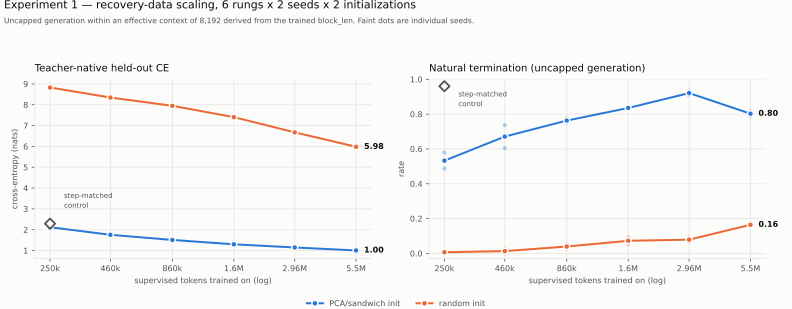

# AlphaAvatar-distill

## 📈 Performance Trend and Project Goal

AlphaAvatar-distill is an agent-guided model compression and distillation framework for turning large teacher models into small, real-time, edge-deployable students.

The goal is to make distillation reproducible and automated, producing efficient student models with long-context and multi-turn comprehension, strong reasoning and self-correction, and reliable accuracy across sustained interactions and long-running agentic workloads such as AlphaAvatar—including RAG, tool use, quantized inference, and low-latency deployment.

**Positioning: teacher checkpoint → arbitrary requested target size.** The framework is
not a fixed recipe for one teacher/student pair. It takes a teacher checkpoint, a target
architecture, a calibration pool and a search budget, and produces an initialized student
of exactly the requested size. The current study is 4B → ~596M; the same machinery is
intended to carry a later ~30B → ~4.xB setting, so nothing in the search engine may
hard-code layer counts, hidden or FFN sizes, head counts, or a target parameter count.

### Current state

| | |
| --- | --- |
| current best behaviour | E1/P1 KD-heavy at the 2.96M rung (`e1_r2960k_sb_pca` lineage) |
| frozen battery | 150 prompts, inclusion mask `d6e24e0b09da1bcc…`, sampled from the 0.86M rung |
| retained reference on it | usable_rollout 0.7300 · correct_overall 0.1867 · correct_given_usable 0.2511 |
| active work | **Teacher-Adaptive AutoInitializer** — framework implemented at zero cost; no paid search authorized |
| last completed experiment | **E8a** — contribution-guided depth search |
| E8b | **strategically terminated; no valid recovered-behaviour comparison** |
| actual cumulative spend | **$180.7033** against a $211.07 cap ([ledger](./logs/BUDGET_LEDGER.md)) |
| proposed next paid step | AutoInitializer pilot, $16.00 expected / $19.00 hard — **unauthorized** ([proposal](./logs/autoinit_pilot_proposal.md)) |

### Repository map

| you want | read |
| --- | --- |
| current state, in minutes | [`logs/STATE.md`](./logs/STATE.md) |
| **the next session's brief** | [`docs/HANDOFF_AUTOINITIALIZER.md`](./docs/HANDOFF_AUTOINITIALIZER.md) |
| what each experiment proved | [`logs/EXPERIMENT_INDEX.md`](./logs/EXPERIMENT_INDEX.md) |
| decisions and their reasons | [`logs/decisions.md`](./logs/decisions.md) |
| which checkpoints exist, and why | [`logs/checkpoint_registry.json`](./logs/checkpoint_registry.json) |
| what was deleted, and how to rebuild it | [`logs/checkpoint_tombstones.json`](./logs/checkpoint_tombstones.json) |
| actual spend vs authorization | [`logs/BUDGET_LEDGER.md`](./logs/BUDGET_LEDGER.md) |
| machine-readable state | [`logs/current_state.json`](./logs/current_state.json) |
| the AutoInitializer search space and its cost | [`logs/autoinit_v1_search_space.json`](./logs/autoinit_v1_search_space.json) |
| the proposed first paid pilot | [`logs/autoinit_pilot_proposal.md`](./logs/autoinit_pilot_proposal.md) |
| superseded plans (provenance only) | [`logs/archive/`](./logs/archive/) |
| per-session chronology | [`logs/EXPERIMENTS.md`](./logs/EXPERIMENTS.md) |

**Research transition.** The next phase is a **Teacher-Adaptive AutoInitializer** —
search over initialization operators, operator order and calibration configuration, with
conditional remeasurement after every operator. **It is not implemented yet**; the
architecture is decided and recorded in the handoff.

**One place for the experiment history: [`logs/EXPERIMENT_INDEX.md`](./logs/EXPERIMENT_INDEX.md)**
— what each of E1–E8 asked, what it proved, what it does *not* support, and which
checkpoints still matter. Chronology and per-session detail live in
[`logs/EXPERIMENTS.md`](./logs/EXPERIMENTS.md); this README keeps only current state.

### What E1–E8 established

1. **PCA/structural initialization decisively beats random initialization** (E1).
2. **Same-distribution scaling improved autonomous stability, not reasoning correctness** (E1, E6).
3. **KD-heavy scales better than CE-heavy on autonomous stability** (E4, E6b).
4. **Extra unseen-text KD (FineWeb-Edu) strongly recovers general language modelling
   without solving autonomous reasoning** (E7).
5. **General-language NLL is not a reliable promotion criterion** (E7).
6. **A full-width depth-ablation proxy does not predict the fully-compressed step-0
   initializer** (E8a) — the contribution map preserves the teacher 3.11× better at full
   width and initializes 2.8 nats worse once composed with width/FFN/attention
   compression.
7. **E8b did not complete recovered behaviour** and must not be used to claim a
   depth × compression interaction.

### Why NLL and CE are diagnostics, not promotion criteria

Promotion, arm selection and stage advancement are decided on the **frozen autonomous
rollout evaluation**. Held-out NLL was retired as a selector after the checkpoint with the
best NLL of its trajectory produced *zero* protocol-valid generations, and E7 then
restored general language modelling substantially while behaviour did not move at all.
NLL, CE, teacher KL, top-1 and rank remain useful for training health and for diagnosing
initialization — never for choosing a checkpoint.

### Why the project is moving to an AutoInitializer

E8a produced the motivating result: a proxy measured on the *full-width* teacher ranks
depth maps in the opposite order from the *fully compressed* step-0 initializer. A single
fixed recipe cannot resolve that, because the right choice for one operator depends on
which operators have already been applied. The successor system therefore searches over
initialization **operators, operator order, and calibration configuration**, remeasuring
the actual checkpoint after every operator, and admits only complete target-size
candidates to a fixed low-budget recovery probe. Design constraints are recorded in
[`logs/decisions.md`](./logs/decisions.md); **no paid search is authorized.**

The methods are meant to be **model-family-agnostic**: the same activation-statistics initialization, recovery training and deployment-numerics gates should apply to dense LLMs, MoE, VLM and Omni-models alike. That is a design constraint on the algorithm core, not a claim — the run below is a dense text **baseline**, and no MoE, vision or audio model has been attempted or validated ([scope decision](./logs/decisions.md)).

[](./assets/e1_scaling.svg)

**Where the project stands.** Two things are established and one is not.

**Stage 0/1 — the teacher-derived initialization works, and its downstream value
is proven.** Step-0 held-out NLL is 11.7482 nats against a random initialization's
12.1286 (teacher: 2.6264). That −0.38-nat edge is small, but downstream it decides
everything: across 12 matched Experiment 1 pairs — same rung, seed, budget and
optimizer, differing only in initialization — the PCA init wins **12/0/0** on
autonomous-rollout behaviour and **11/1/0** on GSM8K. **Random initialization
produces zero usable rollouts at every data rung through 2.96M supervised
tokens.** This is the strongest result in the project.

**Stage 2/3 — no model has demonstrated passage of a prospectively defined
behaviour-recovery gate.** The student can be trained to hold the teacher's
protocol most of the time, and cannot yet be trained to hold it reliably. The best
arm produces a well-formed, self-terminating rollout on **84%** of prompts. **The
dominant failure is that the model does not stop:** most of the rest run to the
8,192-token context limit, usually in a repetition loop, and about one prompt in
eight is answered with nothing at all.

**Behaviour responds to scale; reasoning does not respond to anything tried.**
Autonomous rollout stability has moved 0.5333 → 0.7300 → **0.8400** across the
0.86M → 1.60M → 2.96M token budgets and then stops (5.50M: 0.8500, a tie). Over
the same range correctness never leaves 0.11–0.21, and `correct_given_usable`
drifts *down* as stability rises (0.2511 → 0.2460 → 0.2039). Each intervention
that makes more rollouts well-formed makes them well-formed *and wrong*. The
sharpest single view: **GSM8K usable rollout climbs 0.71 → 0.92 while GSM8K
correctness stays at 0.00–0.05.** The model learns to finish a maths problem, not
to solve one.

**That scaling gain belongs to one objective, not to the data.** There is
evidence of objective-dependent scaling: the KD-heavy objective converts the
larger rung into stability (+0.1100) while the CE-heavy one does not demonstrate
the same conversion (+0.0267). The pooled interaction is −0.0833, but its
per-seed values are −0.0133 and −0.1533, so **the exact magnitude is
seed-sensitive and is not quoted as an effect size.** The strongest evidence is
the same-scale comparison at 2.96M: KD-heavy over CE-heavy by **−0.0800 usable on
both seeds**, both paired CIs excluding zero.

**And it is a gain in stability, not in reasoning.** At 2.96M the two objectives'
correctness ties under the registered floor, and correctness *among usable
rollouts* is essentially identical (0.2460 vs ≈0.2460). More generations
terminate and become judgeable; completed generations do not reason more
accurately. Both objectives also improve teacher-native CE almost identically
(1.31 → 1.17 against 1.30 → 1.15) while only one moves behaviour — the cleanest
evidence yet for the standing rule that **diagnostics may never select a
checkpoint**.

**And restoring general language modelling does not help either.** The rollout
recipe destroys general text — held-out FineWeb NLL falls to 6.16 by the 0.46M
rung and climbs back to ~9.5 by 1.60M. Adding general-text teacher KD alongside
the unchanged rollout stream **restores it decisively: −5.22 nats, both seeds,
teacher KL 7.34 → 1.94, top-1 up 9×.** Autonomous behaviour moved by **nothing**
— usable rollout +0.0000 against the baseline, every paired comparison inside its
registered floor, GSM8K correctness 0.0000 on five of six arms. A matched
in-domain control recovers 90% of the same NLL gain, so what restores general
text is *extra KD signal on unseen text*, largely regardless of which text. Lost
language modelling is **not** what causes the correctness ceiling.

**What is not the problem.** The released `Qwen3-0.6B` — the student's exact
geometry and parameter count — answers ~70% of GSM8K and ~74% of RAG on this
project's own frozen battery under this project's own protocol. A model this size
can do the task and the battery is not too hard. That bounds the *task*; it does
**not** localise our gap, which belongs to the whole training stack and trajectory
— initialization, data, token budget, stages, curriculum and objectives — until
evidence separates them.

**Current experiment:** [Qwen/Qwen3-4B-Thinking-2507](https://huggingface.co/Qwen/Qwen3-4B-Thinking-2507) → a 0.6B-class student (Qwen3-0.6B geometry, ~6.7× compression, INT8 deployment target).

Full record: [`logs/EXPERIMENTS.md`](./logs/EXPERIMENTS.md). Current state and next
actions: [`logs/STATE.md`](./logs/STATE.md). Total paid compute to date: **$160.16**.

### How Stage 2/3 is measured

The primary metric is `usable_rollout` — can the student produce a well-formed
trajectory on its own?

```
usable_rollout = non_empty AND natural_termination AND no_severe_repetition
                 AND no_context_limit AND protocol_valid
```

Reported with **every component rate**, never as a weighted average. Correctness
is a **separate secondary axis**; teacher-forced top-1, teacher-native CE, FineWeb
NLL and training loss are **diagnostics only** and are never combined onto one
scale. Two caveats travel with the metric: it is blind to correctness by
construction (a terse well-formed reply scores perfectly), and its components are
**not independent** — `protocol_valid` subsumes two of them, and empirically
`usable_rollout == protocol_valid` on 897/900 samples.

### What has been ruled out

| tried | result |
| --- | --- |
| More recovery data (0.25M → 5.50M, 24 arms) | Teacher-native CE falls monotonically and has not saturated. Behaviour improves to ~0.59; reasoning does not emerge. |
| Selecting on held-out NLL | **Retired.** The checkpoint with the best held-out NLL of its trajectory produces *zero* protocol-valid generations. |
| Assistant-only KD (`kd_scope`) | No seed-consistent gain; teacher-forced reasoning top-1 fell 0.049. |
| Swapping the CE/KD weights | Null on the selector (+0.007 against a 0.060 seed spread); top-1 fell 0.014. |
| Restricting attention updates (frozen, and LoRA r32/α64) | **Degrades** stability: −0.087 and −0.093 usable rollout, both seeds, every component. |
| Scaling 0.86M → 1.60M tokens | Stability **+0.2000** (both seeds, CIs exclude zero); correctness +0.0100, inside the floor. The gain belongs to scale, not to the objective — P1 gained equally. |
| Student-prefix recovery continuation | **Worse than not continuing at all**: −0.087 usable rollout and −0.080 correctness against its own start point. Trained only on continuations, it never learns to stop. |
| Teacher-prefix continuation | Ties the matched-CE anchor on behaviour (0.7667 vs 0.7333, inside the floor) and appears to **cost** correctness (0.1300 vs 0.2000, one seed's CI excluding zero). |
| Scaling 1.60M → 2.96M tokens (KD-heavy) | Stability **+0.1100** (both seeds, above the floor); correctness +0.0200, inside it. Termination is what improves: context-limit hits fall 28/44 → 19/23 prompts. |
| Scaling 2.96M → 5.50M tokens | **Saturated**: +0.0100, inside the floor, seeds disagreeing. Past 2.96M only the diagnostics keep moving. |
| Scaling 1.60M → 2.96M tokens (CE-heavy) | **A tie**: +0.0267, inside the floor, seeds disagreeing. The same rung that buys the KD-heavy objective +0.1100 buys this one nothing. |
| **General-text teacher KD (FineWeb-Edu)** | **Restores general language modelling and nothing else.** Held-out FineWeb NLL −5.22 nats, teacher KL 7.34 → 1.94, top-1 up 9× — and usable rollout **+0.0000** against the baseline, every paired comparison inside its floor. |
| **Matched extra in-domain KD (E7 control)** | Recovers **90%** of the same NLL gain from *in-domain* text, so the restoration is about extra KD signal on unseen text, not about general prose. Behaviour: a tie on every axis. |

Reducing KD's influence two independent ways cost teacher-distribution fidelity in
proportion to the dose, so **reweighting the existing two loss terms is not the
lever**. The token budget *was* the strongest lead and it delivered — on
behaviour only. Scaling to 1.60M bought +0.20 usable rollout and nothing
measurable in correctness, and neither continuation recipe beat it.

**Eleven interventions. Scale is the only one that has ever moved behaviour, and
nothing has ever moved reasoning.** E7 also *removed* a candidate explanation:
general language modelling can be restored almost completely with no behavioural
effect at all, so the correctness ceiling is not a language-modelling problem.
What remains unseparated is the token budget beyond 1.60M, the data mixture, the
initialization, and the possibility that Stage 3's teacher-forced offline
objective cannot produce reasoning at this scale regardless of how it is
weighted — which is what Stage 4/5 on-policy work exists to test.

<details>
<summary><b>Experiment 1 — recovery-data scaling (24 arms + compute control, $61.5)</b></summary>

Six nested data rungs (0.25M → 5.50M supervised tokens) × 2 seeds × 2
initializations, each trained a fixed 3 passes over its own rung, plus a
step-matched compute control.

| supervised tokens | PCA CE | random CE | PCA natural-termination | PCA GSM8K EM |
|---:|---:|---:|---:|---:|
| 0.25M | 2.1183 | 8.8263 | 0.533 | 0.005 |
| 0.46M | 1.7544 | 8.3461 | 0.671 | 0.000 |
| 0.86M | 1.5069 | 7.9472 | 0.763 | 0.000 |
| 1.60M | 1.2983 | 7.4047 | 0.835 | 0.040 |
| 2.96M | 1.1468 | 6.6727 | **0.921** | 0.015 |
| **5.50M** | **1.0042** | **5.9798** | 0.803 | 0.020 |

- **CE scales with data decisively** — 74× (PCA) and 261× (random) the
  between-seed noise, monotone at every rung, **not saturated at 5.50M**.
- **The improvement is data, not compute.** The step-matched control — same init,
  seed, optimizer, schedule and step count, differing *only* in unique data —
  reached CE 2.2907, **worse** than the same rung at 324 steps.
- **No reasoning emerged anywhere.** GSM8K exact match across all 25 checkpoints:
  min 0.000, max 0.050, mean 0.006.

Reviewable samples: [`logs/e1_test_cases.md`](./logs/e1_test_cases.md).

</details>

<details>
<summary><b>Superseded metric — the pre-Experiment-1 run table</b></summary>

These runs were scored on `behavior_score_v0` under a **512-token generation
cap**, which AGENTS.md P18 now forbids for formal measurement — the cap was hiding
repetition loops rather than measuring behaviour. Kept as the record of how the
recovery recipe was built; **not comparable point-for-point** with anything above.

| # | date | run | starts from | what changed | total steps | behavior | held-out NLL |
| ---: | --- | --- | :---: | --- | ---: | ---: | ---: |
| 1 | 2026-07-14 | [init v0, recipe attempt 1](./logs/EXPERIMENTS.md) | — | early-band depth merge, unweighted projection | 0 | – | 17.7977 |
| 2 | 2026-07-14 | [init v0, fixed recipe](./logs/EXPERIMENTS.md) | — | middle-band merge, end-weighted projection | 0 | – | 11.7482 |
| 3 | 2026-07-22 | [s1 recovery](./logs/EXPERIMENTS.md) | #2 | FFN+norm, CE 0.25 + KD 1.0, 660 steps on mixture v0 | 660 | 12.9% | 4.2107 |
| 4 | 2026-07-25 | [s2 A/B arm A](./logs/EXPERIMENTS.md) | #3 | control: +660 FFN-only steps; regressed on mixture-v0 epochs 3–4 | 1320 | – | 4.2747 |
| 5 | 2026-07-25 | [s2 A/B arm B](./logs/EXPERIMENTS.md) | #3 | attention unfrozen; freeze set adopted, holdout flat (data-limited) | 1320 | – | 4.2118 |
| 6 | 2026-07-26 | [s2 on mixture v1](./logs/EXPERIMENTS.md) | #5 | same recipe, 4.11× data, 2700 steps; plateau broken | 4020 | 8.9% | **3.8003** |
| 7 | 2026-07-27 | [start-point ablation: from_s1](./logs/EXPERIMENTS.md) | #3 | same 2700-step leg from s1@660; the A/B arm-B leg was neutral (+0.17%) | 3360 | 9.5% | 3.8067 |
| 8 | 2026-07-27 | [start-point ablation: from_init](./logs/EXPERIMENTS.md) | #2 | single-stage from Stage 1 init, 2700 steps total; warm-up ladder unnecessary (+0.74%) | 2700 | **20.2%** | 3.8285 |

**Both metrics in this table are retired.** `behavior_score_v0` was the headline at the time and resolves at only 3.3x its seed spread; held-out NLL (±1% band) was its guard rail and was later retired as a selection identity outright. Reference values — teacher Qwen3-4B-Thinking-2507 2.6264 · random-init 0.6B baseline 12.1286. The current Stage 2/3 primary metric is `usable_rollout`; see logs/EXPERIMENTS.md.

Attempts 7–8 are a fixed-budget ablation of the *start point*: all three branches
ran the identical 2,700-step leg at the same seed from lineages costing 4,020,
3,360 and 2,700 total steps. All landed inside the pre-registered 1% band, so the
recipe dropped its two warm-up legs and became a single stage. The behaviour eval
**reversed the ranking held-out NLL gives**, which is why the headline metric
changed — and, later, why held-out NLL was retired outright. One run per arm, no
variance estimate.

The figure [`assets/performance_trend.svg`](./assets/performance_trend.svg)
regenerates from [`assets/perf_trend.json`](./assets/perf_trend.json) with
`uv run python scripts/evaluation/plot_perf_trend.py`.

</details>

---

## 🧠 How it works

| Stage | What it produces | Status |
| --- | --- | --- |
| **0** — activation statistics | streaming float64 sufficient statistics from the teacher: per residual point count / sum / `XᵀX`, per-FFN-neuron `Σ\|a\|` and `Σa²`, token frequencies. Fixed 1.95 GB cache regardless of token count. | passed ([log](./logs/EXPERIMENTS.md)) |
| **1** — projection + sandwich init | a complete, runnable Qwen3-format 0.6B student (596M params) plus a same-geometry random baseline, both with reproducibility manifests. | passed ([log](./logs/EXPERIMENTS.md)) |
| **2** — offline warm-up mixture | eight training-use groups from permissive revision-pinned sources (instruction, RAG/evidence, multi-hop QA, tool calling, refusal/uncertainty, code/math, short realtime, long context) with global dedup, holdout exclusion, and train/val/calib splits. | v0 5.39M tokens ([log](./logs/EXPERIMENTS.md)), v1 22.13M ([log](./logs/EXPERIMENTS.md)) |
| **3** — student recovery | one config-driven trainer for all recovery sub-stages: regex freeze policy, masked CE + on-the-fly full-vocab teacher KD, exact resume, per-run manifests, gate evals. Plus the recovery corpus builder (teacher generation at the model's official preset, session rendering, system-grouped packing, nested token ladder) and an uncapped vLLM evaluation harness with a semantic degeneration detector. | **open.** Experiment 1 (24-arm scaling + compute control) and three loss/scope experiments are complete and recorded; **no model has demonstrated passage of a prospectively defined behaviour-recovery gate** ([results](./logs/EXPERIMENTS.md)). Best `usable_rollout` ~0.61; 31% of rollouts never terminate |
| **4–6** — online data, on-policy distillation, deployment validation | specified in [`AGENTS.md`](./AGENTS.md) | not started |

Design choices worth knowing:

- **Sufficient statistics, not activation dumps.** Stage 0 caches exactly what Stage 1 consumes (second moments, neuron importances, token frequencies) in float64, so the cache is O(1) in token count and the centering step stays numerically sound.
- **One global projection, transplanted sandwich-style.** Every teacher linear becomes `Pᵀ·W·P` with the preceding RMSNorm folded in exactly; Q heads are subsampled per GQA group, FFN neurons kept by activation importance, depth compressed by merging middle-band layer pairs. Attempt 1 in the table above is what happened when the merge band was wrong — the recipe is evidence-driven, not assumed.
- **Loss masks are computed from character offsets.** The Thinking-2507 chat template is *not* prefix-stable (it injects an empty think block into the final assistant turn), so the usual per-turn prefix diffing miscounts spans. The loader renders the conversation once and maps assistant character spans to tokens.
- **KD runs on the fly over the full vocabulary.** The teacher forwards the same packed blocks each step — no cached logits, so the corpus is not welded to one teacher revision and top-k approximation is unnecessary.
- **Block order is a pure function of (seed, epoch).** An interrupted run resumes bitwise-exactly. The validation subset is seed-derived too, which is why runs meant to be compared must share a seed ([decision record](./logs/decisions.md)).
- **Deployment numerics are a gate, not an afterthought.** Every recovery gate re-evaluates under INT8 weight fake-quantization at two scopes, so quality that quantization would destroy never counts as progress.
- **Ablations are config diffs.** Compared arms differ from their reference run in exactly one meaningful field, verified by diff — the start-point ablation and the packing control were both run this way.
- **Teacher sessions are rendered one at a time, then concatenated as tokens.** The official Thinking-2507 template renders `<think>…</think>` only for the assistant turn after the *last* user message, so applying it to a multi-session message list silently deletes every earlier reasoning trace. Measured directly, then designed around: each session renders alone, the system block is emitted once, and the token-level concatenation is asserted exact.
- **The system prompt is a hard packing boundary, and it is expensive.** Tool schemas render into the system block, so tool sessions almost never share a packed block: at the top ladder rung they supply 15% of the supervision and consume 72% of the blocks (efficiency 0.092 against 0.985 elsewhere). The rule was kept and the padding paid for, rather than relaxed ([decision](./logs/decisions.md)).
- **The core is kept family-agnostic, and is explicit about where it currently isn't.** Stage 0 hooks `mlp.down_proj` and fails loudly on anything else; Stage 1 assumes a dense SwiGLU MLP, GQA attention and one residual stream; the loader and behavior scorers are text-chat specific. Those are precisely the places an MoE, VLM or Omni port would touch — [inventoried](./logs/decisions.md) rather than abstracted away before a second family exists (P1/P2: no plugin system built on speculation).

Every run records config hash, code state, dataset/tokenizer/teacher hashes, and gate-check results; heavy artifacts stay out of git. GPU sessions run under a durable OS-level orchestrator that trains, evaluates, uploads artifacts, verifies the upload against pod-side hashes, generates the write-up, and tears the pod down unattended.

---

## ⚡ Quick start

```bash
uv sync                    # CPU torch by default; see pyproject.toml for a CUDA index
uv run pytest tests/ -q    # 1,084 CPU tests, no downloads
```

The implemented pipeline runs end to end on CPU (GPU optional):

```bash
# corpora (revision-pinned public sources; the jsonl files stay gitignored)
uv run python scripts/data/build_warmup_v1.py       # Stage 0/1 warm-up (~1M tokens)
uv run python scripts/data/build_holdout_v1.py      # held-out eval set
uv run python scripts/data/build_stage2_v0.py       # offline mixture v0 (5.39M train tokens)
uv run python scripts/data/build_stage2_v1.py       # offline mixture v1 (22.13M train tokens)

# Stage 0 → 1: teacher statistics (~1 h CPU; dry run with --limit 2), then init (~5 min)
uv run python scripts/training/collect_stage0.py --config configs/stage0/qwen3_4b_thinking_v1.json
uv run python scripts/training/init_stage1.py --config configs/stage1/qwen3_0p6b_from_4b_thinking.json

# gate check
uv run python scripts/evaluation/eval_ppl.py --data data/warmup/holdout_v1.jsonl \
  --model artifacts/stage1/qwen3_0p6b_init_v0/checkpoint \
  --model artifacts/stage1/qwen3_0p6b_init_v0/random_baseline

# Stage 3 recovery: the canonical config, resumable through the same code path
uv run python scripts/training/train_stage3.py --config configs/stage3/recovery.json
uv run python scripts/training/train_stage3.py --config configs/stage3/recovery.json --resume

# any checkpoint, at the deployment precision (bf16 baseline + INT8 weight fake-quant)
uv run python scripts/evaluation/eval_ppl.py --data data/warmup/holdout_v1.jsonl \
  --model artifacts/stage1/qwen3_0p6b_init_v0/checkpoint \
  --fake-quant int8 --fake-quant-scope decoder

# behaviour, generated WITHOUT an artificial token budget (AGENTS.md P18)
uv run python scripts/evaluation/eval_behavior.py --unrestricted \
  --model artifacts/stage1/qwen3_0p6b_init_v0/checkpoint \
  --out artifacts/eval/step0_behavior.json
```

The Stage 3 recovery corpus is generated by the teacher, so its first step needs
a GPU; the pack, the token ladder and the gate are CPU work on its output.

```bash
# teacher generation (GPU, vLLM) — n=4 at the model's official preset,
# 8192-token end-to-end sessions. --limits sets how many prompts per type.
uv run python scripts/rollout/build_recovery_corpus.py --engine vllm --n 4 \
  --limits gsm8k=1700,openmath=900,code=1200,tool_calling=2600,rag_evidence=4100,multihop_qa=1074 \
  --out artifacts/stage3_corpus_v2

# one pass of system-grouped packing, cut into six nested token rungs (CPU)
uv run python scripts/data/build_token_ladder.py \
  --sessions artifacts/stage3_corpus_v2/sessions.jsonl \
  --mixture gsm8k=0.22,openmath=0.17,code=0.16,tool_calling=0.15,rag_evidence=0.20,multihop_qa=0.10 \
  --out artifacts/stage3_ladder_v2

# gate: template, seeds, budgets, masks, packing, nesting, loader round-trip
uv run python scripts/data/validate_corpus_gate.py \
  --corpus artifacts/stage3_corpus_v2 --packed artifacts/stage3_ladder_v2 --skip-logits
```

`configs/stage3/recovery.json` is the single recovery recipe; a run differs from
it only in `data_dir` and `schedule.total_steps` — hardware never changes the
experiment definition. Each step writes gitignored artifacts plus a full reproducibility manifest under `artifacts/` or `data/`.

---

## 🤖 Running the agent

This project is developed by autonomous coding agents (e.g. Claude Code, Codex, Cursor). [`AGENTS.md`](./AGENTS.md) is the single source of truth for agent instructions and must be read before making any change to this repository.

The first dense-model compression experiment was kicked off with this instruction:

> Hi, have a look at the AlphaAvatar-distill repo and start from the teacher model https://huggingface.co/Qwen/Qwen3-4B-Thinking-2507. Let's kick off the first dense-model compression experiment.

Everything under `src/`, `scripts/`, and `logs/` grew from that instruction, following the staged workflow in `AGENTS.md`. The working split is: agents act directly on local, reversible, CPU-scale work, and write a **costed proposal with pre-registered decision rules** for anything paid, long-running, or public-facing — the maintainer approves per session. The active proposal lives in [`logs/archive/PROPOSAL.md`](./logs/archive/PROPOSAL.md); current state and next actions in [`logs/STATE.md`](./logs/STATE.md).

---

## 🗂️ Project structure

Code is grouped by **responsibility**; configs, logs and tests by **training stage**.
[`docs/REPO_LAYOUT.md`](./docs/REPO_LAYOUT.md) is the full map and the rule for where new files go.

```text
AlphaAvatar-distill/
├── AGENTS.md               # agent working contract (single source of truth)
├── docs/REPO_LAYOUT.md     # where code, configs, logs and artifacts belong
├── pyproject.toml          # uv-managed env; CPU torch index by default
├── src/aadistill/          # algorithm core — model-agnostic, config-driven
│   ├── models/             #   teacher/student loading, INT8 fake-quant
│   ├── init/               #   Stage 0/1: activation stats, projection, sandwich transplant
│   ├── autoinit/           #   Teacher-Adaptive AutoInitializer: architecture adapters,
│   │                       #   operator kind/implementation registry, versioned search
│   │                       #   state, four-level metric taxonomy, Pareto beam ranking,
│   │                       #   resumable beam search, search manifest, cost model
│   ├── data/               #   mixture loader (schema, chat render, loss masks, packing),
│   │                       #   session rendering + system-grouped packing (sessions.py),
│   │                       #   diversity, per-slice correctness rules,
│   │                       #   dense KD-only extra streams (extra_stream.py)
│   ├── training/           #   Stage 3 recovery trainer (CE+KD, freeze policy, resume,
│   │                       #   optional second KD-only stream with its own cursor)
│   ├── rollout/            #   engine adapters, in-stack generation, hashed rollout
│   │                       #   snapshots + importance-ratio diagnostics
│   ├── evaluation/         #   usable_rollout (Stage 2/3 primary metric), strict
│   │                       #   answer/protocol scorers, degeneration, oracle prefix,
│   │                       #   general-text NLL/KL diagnostics (general_text.py)
│   └── infrastructure/     #   env fingerprint, code-state hash, sha256 manifests ·
│                           #   session budget thresholds · provider control plane ·
│                           #   cost watchdog · detached remote launch · log relay ·
│                           #   manifest-driven artifact collection + teardown gate
├── scripts/                # entry points, one per responsibility
│   ├── data/               #   mixture + eval-set builders · build_token_ladder ·
│   │                       #   validate_corpus_gate
│   ├── training/           #   collect_stage0 · init_stage1 · train_stage3 ·
│   │                       #   build/validate arm configs · budget planning · preflight
│   ├── evaluation/         #   eval_ppl · eval_behavior · uncapped_eval (P18, vLLM) ·
│   │                       #   degeneration · audit_prompt_rendering · exposure_report ·
│   │                       #   consolidate_e1 · build_test_cases · plot_perf_trend
│   ├── rollout/            #   teacher generation · build_recovery_corpus
│   ├── autoinit/           #   plan_search (branching + cost) · dry_run_search (zero cost)
│   └── pod/                #   GPU session scripts + durable orchestrator (run_env.sh) ·
│                           #   start_job · watchdog · collect_artifacts (session contract)
├── configs/                # stage recipes: stage0/ · stage1/ · stage3/recovery.json
│   └── autoinit/           #   frozen operator-implementation ledger (ids are immutable)
├── data/                   # corpus manifests (jsonl gitignored, rebuildable)
│   └── eval_behavior_v0/   #   76-prompt behavior set + manifest (both committed)
├── tests/                  # 1,415 CPU tests, mirroring the source areas
├── logs/                   # project memory — read STATE.md first
│   ├── STATE.md            #   canonical handoff: a snapshot, not an archive
│   ├── EXPERIMENTS.md      #   the consolidated record: what ran, results, cost
│   ├── PROPOSAL.md         #   the single active plan, costed, with stopping rules
│   ├── decisions.md        #   decision records (why, alternatives, risks)
│   ├── supported_models.md #   model status table
│   └── artifact_manifests.md  # artifacts stored outside git (HF), with hashes
└── assets/                 # trend data + rendered figure
```

The tree is abridged to the parts worth knowing about. New directories appear only when an implemented, verified milestone needs them — no empty placeholders. Model weights, activation caches and experiment artifacts are kept out of git (`.gitignore`); large checkpoints live in a private Hugging Face repo with hashes recorded in `logs/artifact_manifests.md`.

On 2026-07-31 the 25 per-run experiment logs and 11 per-experiment proposals were consolidated into [`logs/EXPERIMENTS.md`](./logs/EXPERIMENTS.md) and [`logs/archive/PROPOSAL.md`](./logs/archive/PROPOSAL.md), and ~26 GB of superseded artifacts were removed. The originals remain in git history at commit `866dac2`.

**Checkpoint retention is uneven and tracked.** Weights live outside git, on the
private relay or the dev box, with hashes in
[`logs/artifact_manifests.md`](./logs/artifact_manifests.md). One arm's weights
(`P0-assistant`) were discarded and are unrecoverable — recorded rather than
quietly dropped, because the loss bounds what can be re-measured.

---

## 🏆 Optim record history

Official records are stricter than ordinary experiments (AGENTS.md 3.8): exact commit, command, hardware, data and tokenizer hashes, budget, metric log, and maintainer approval.

**No records are being kept during baseline construction** (maintainer decision, 2026-07-28). Everything run so far — including every Stage 3 run in `logs/EXPERIMENTS.md` — is baseline work. The **first record point** will be written once the baseline is carried through Stage 6 deployment validation with satisfactory results; it will be the first entry, not a backfill. Until then every section below is intentionally empty, and every number on this page is an attempt, not a record.

This applies to the Stage 0/1 initialization result above as well: it is a strong,
reproducible finding, but it has not been through the record procedure and is not
claimed as one.

### 🧪 Stage 0 — Initialization warm-up data collection

_No records yet._

### 🧩 Stage 1 — Projection and structural initialization

_No records yet._

### 📚 Stage 2 — Offline warm-up data collection

_No records yet._

### 🛠️ Stage 3 — Student recovery

_No records yet._

### 🔁 Stage 4 — Online data collection

_No records yet._

### 🎯 Stage 5 — On-policy distillation

_No records yet._

### 🚀 Stage 6 — Deployment validation

_No records yet._

---

## 🔎 References

| Reference | Topic | Status | Why it matters here |
| --- | --- | --- | --- |
| Muralidharan et al., *Compact Language Models via Pruning and Knowledge Distillation* (Minitron), NVIDIA, 2024. [arXiv:2407.14679](https://arxiv.org/abs/2407.14679) | ffn-pruning, distillation | used | Activation-magnitude neuron/head importance for structured width pruning; establishes that pruned-before-recovery students score near-noise zero-shot and rely on distillation recovery. Informed Stage 1 FFN top-k selection and the interpretation of the init-checkpoint eval ([log](./logs/EXPERIMENTS.md)). |
| Gromov et al., *The Unreasonable Ineffectiveness of the Deeper Layers*, 2024. [arXiv:2403.17887](https://arxiv.org/abs/2403.17887) | depth-compression | used | Layer-drop studies show early layers are critical and middle/late-middle layers are most redundant. Motivated moving Stage 1 depth merging from the early band to the middle band after the early-merge ablation collapsed. |
| Xia et al., *Sheared LLaMA: Accelerating Language Model Pre-training via Structured Pruning*, 2023. [arXiv:2310.06694](https://arxiv.org/abs/2310.06694) | svd-compression, distillation | queued | Structured pruning with mask learning + continued pre-training; candidate comparison recipe for Stage 3 recovery design. |
| Kim & Rush, *Sequence-Level Knowledge Distillation*, EMNLP 2016. [arXiv:1606.07947](https://arxiv.org/abs/1606.07947) | distillation, offline-data | queued | Training the student on the teacher's *generated* targets rather than on gold targets reweighted by the teacher. Basis of the pending teacher-generated-answer proposal, which targets the answer-style defects that survived the mixture-v1 recovery run ([proposal](./logs/EXPERIMENTS.md)). |
| Zelikman et al., *STaR: Bootstrapping Reasoning With Reasoning*, NeurIPS 2022. [arXiv:2203.14465](https://arxiv.org/abs/2203.14465) | offline-data, distillation | queued | Keep only generations whose final answer matches the reference. The correctness gate the same proposal now requires (2026-07-28 directive) is this filter applied to the *teacher*: a generated target is trained on only when it verifies against the public gold key it replaces. |
| Karpathy, *nanochat* — minimal full-stack LLM training/inference repo, 2025. [github.com/karpathy/nanochat](https://github.com/karpathy/nanochat) | kernel, distributed-training | queued | A dependency-minimal reference for how an efficient training loop is actually assembled (~8k LOC covering tokenizer → pretrain → midtrain → SFT → RL → serve). To be read **before** adding any kernel dependency here: the question it answers is which kernels earn their place in a small codebase and how they are called, which is the cheaper first move than importing a framework ([kernel plan](./logs/decisions.md)). |
| Ding et al., *Fewer Truncations Improve Language Modeling*, ICML 2024. [arXiv:2404.10830](https://arxiv.org/abs/2404.10830) | offline-data, distillation | used | Concatenate-then-cut packing silently truncates documents at every block boundary and measurably hurts grounded generation; best-fit-decreasing bin packing removes the truncations at the same token efficiency. Adopted as `best_fit_blocks`, and now **measured**: teacher-native targets exceed the current 1024-token block 48.5% of the time, and the naive fix (`best_fit` at 1024) silently discards 56% of the supervised tokens — only `best_fit` at 8192 is lossless ([preflight](./logs/EXPERIMENTS.md)). |
| Krell et al., *Efficient Sequence Packing without Cross-contamination*, Graphcore, 2021. [arXiv:2107.02027](https://arxiv.org/abs/2107.02027) | offline-data, kernel | partially-used | Formalizes packing as bin packing and pairs it with block-diagonal attention so packed samples cannot attend across each other. The packing half is adopted; the **masking half is deliberately rejected** — a deployed assistant reads a window holding several unrelated things and must attend across it, so training it to ignore irrelevant neighbours is the job rather than an artifact to mask ([decision](./logs/decisions.md)). |
| LMSYS, *Towards Deterministic Inference in SGLang and Reproducible RL Training*, 2025. [lmsys.org](https://www.lmsys.org/blog/2025-09-22-sglang-deterministic/) | on-policy, rollout, kernel | partially-used | Batch-invariant kernels give **batch-invariant output** — same prompt, same tokens, regardless of how it was batched — at ~34% average slowdown (CUDA graphs recover ~2.8×), and report identical rollout responses *and* loss values across repeated RL runs. Dense models only, with **Qwen3 named**, which is this project's teacher family. Changes the 2026-07-28 in-stack argument: determinism is now a purchasable tax rather than a reason to avoid a serving engine ([survey](./logs/EXPERIMENTS.md)). **Measured here on SGLang 0.5.12: 241.0 → 108.6 tok/s, a 55% throughput loss — well above the ~34% cited**, which is why deterministic mode is treated as a per-run option rather than a default ([benchmark](./logs/EXPERIMENTS.md)). |
| DeepSeek, *nano-vLLM*, 2025. [HF blog](https://huggingface.co/blog/zamal/introduction-to-nano-vllm) | runtime-deployment | queued | ~1.2k lines, pure Python + Triton, no C++/CUDA extension, offline-inference focus with prefix caching and CUDA graphs; reported near-parity with vLLM on offline workloads. The profile that would give throughput without the dependency weight — determinism properties unknown and unverified by us. |
| Liu et al., *Defeating the Training-Inference Mismatch via FP16*, 2025. [arXiv:2510.26788](https://arxiv.org/abs/2510.26788) | on-policy, rollout, quantization | queued | Argues the RL training/inference gap is mostly a *numerics* problem, and that BF16's 7-bit mantissa is the culprit: reverting the rollout+training path to FP16 removes the mismatch and stabilizes optimization. Directly in tension with this project's BF16 training policy ([decision 2026-07-13](./logs/decisions.md)) — recorded as a **revisit trigger for Stage 4/5**, not acted on, since changing precision now would break comparability with every logged run. |
| vLLM team, *No More Train-Inference Mismatch: Bitwise Consistent On-Policy RL with vLLM and TorchTitan*, 2025. [blog.vllm.ai](https://blog.vllm.ai/2025/11/10/bitwise-consistent-train-inference.html) | on-policy, rollout, kernel | queued | Achieves bitwise-identical sampler and trainer numerics by matching kernels, reporting faster convergence and higher reward. The strongest form of the guarantee this project wants, at the cost of the heaviest stack; the reference point for what "consistent" can mean. |
| Hugging Face, *Native-speed vLLM transformers modeling backend*, 2026. [huggingface.co/blog](https://huggingface.co/blog/native-speed-vllm-transformers-backend) | on-policy, rollout, runtime-deployment | queued | `vllm serve --model-impl transformers` runs vLLM's serving machinery over transformers modeling code, at or above native throughput on Qwen3 4B, so training and rollouts share one model implementation. The **upgrade path** for this project if in-stack generation stops scaling — noted with the caveat that the post makes *no* numerical-consistency claim, so equivalence would have to be measured, not assumed ([decision 2026-07-28](./logs/decisions.md)). |
| Yu et al., *DAPO: An Open-Source LLM Reinforcement Learning System at Scale*, ByteDance Seed, 2025. [arXiv:2503.14476](https://arxiv.org/abs/2503.14476) | on-policy, rollout, offline-data | partially-used | Rollouts are sampled **untruncated** because truncating the tail suppresses low-probability tokens at exactly the high-entropy positions where branching happens, biasing the sampled distribution away from the policy. The **no-greedy-candidate** half is standing — every candidate is sampled, with per-candidate seeds, because with a verifier downstream this is rejection sampling and diversity is what makes accept@n exceed accept@1. The **untruncated** half was reversed in practice: corpus v2 (2026-08-01) generates at the teacher's own published preset, `0.6 / 0.95 / top_k 20 / min_p 0`, so this paper's truncation-bias argument now applies to our corpus and is carried as a known deviation ([decision](./logs/decisions.md)). |
| Yuan et al., *Scaling Relationship on Learning Mathematical Reasoning with Large Language Models*, 2023. [arXiv:2308.01825](https://arxiv.org/abs/2308.01825) | offline-data | queued | Rejection-sampling fine-tuning with k samples per prompt — the source of the top-n recipe the proposal now uses (sample n candidates, keep a verified-correct one) and of its selection-bias and diversity caveats (accepted answers skew toward items the teacher finds easy). |

---

## 📚 Citation

If you use AlphaAvatar-distill in your research or projects, please cite it as:

```bibtex
@misc{alphaavatar_distill_2026,
  author       = {Licheng Wang and AlphaAvatar Contributors},
  title        = {AlphaAvatar-distill: Agentic Model Compression for Realtime and Edge AI Assistants},
  year         = {2026},
  url          = {https://github.com/AlphaAvatar/AlphaAvatar-distill}
}
```
